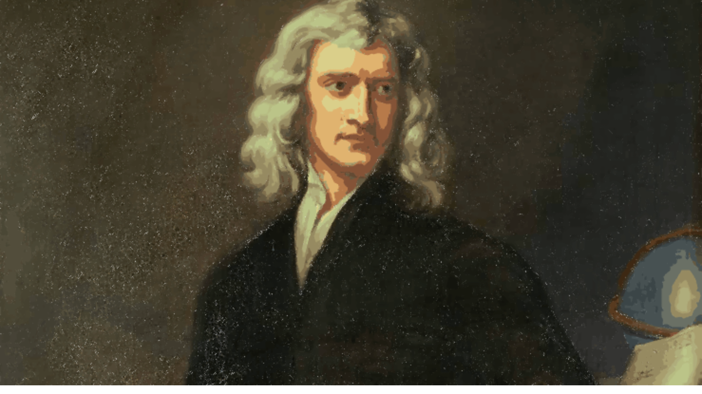

<div align="center">


# Artrace
[](LICENSE)   

---
Turn your photos into stunning stencil and vector art in real time, directly on mobile.

With two unique modes (Stencil & Trace), Artrace lets you fine-tune parameters with sliders, preview instantly, and export results as PNG or SVG.

<table>
   <tr>
      <td align="center"></td>
      <td align="center"></td>
      <td align="center"></td>
   </tr>
   <tr>
      <td align="center"></td>
      <td align="center"></td>
      <td align="center"></td>
   </tr>
</table>
</div>

---
## Features
- Pick any image from your gallery 
- Apply **Trace** or **Stencil** stylization modes
- Fine-tune multiple parameters with real-time preview  
- Smooth performance, supports images up to **3000×3000**
- Export results as **PNG**, **SVG**, or share directly to social media
- Runs entirely on mobile devices

<p align="center">

</p>

---
## Modes:
### *Stencil*
- Applies a high-contrast stencil effect with 3 controllable [parameters](#stencil-parameters)

   <table>
   <tr>
      <td align="center">Original</td>
      <td align="center">Stencil</td>
   </tr>
   <tr>
      <td></td>
      <td></td>
   </tr>
   </table>

   <table>
   <tr>
      <td align="center">Original</td>
      <td align="center">Stencil</td>
   </tr>
   <tr>
      <td></td>
      <td></td>
   </tr>
   </table>


> These examples resemble sketches/drawings, but not all images will look like this. See the Newton example below:


<p align="center">

</p>

> The corner appear darker due to high black levels. You may want to remove or brighten the background first if you want more focus on the main subject.
---

### *Trace*
Vectorize images with 13 [parameters](#trace-parameters) for fine-grained control

   <table>
   <tr>
      <td align="center">Original</td>
      <td align="center">Trace</td>
   </tr>
   <tr>
      <td align="center"></td>
      <td align="center"></td>
   </tr>
   </table>

**Resizing images**:
- Export as SVG and resize without loss of quality, since SVG is vector-based

   <table>
   <tr>
      <td align="center">Original</td>
      <td align="center">Trace</td>
   </tr>
   <tr>
      <td align="center"><br>Original Image 1836 x 4080</td>
      <td align="center"><br>Vectorized image resized to 4788 x 10710</td> 
   </tr>
   </table>

**Improving hand-drawn lines:**
- Artrace can also **improve hand-drawn lines**, making them more vivid by using Trace mode followed by Stencil Mode. See below:

   <table>
   <tr>
      <td align="center">1. Take an image of a drawing</td>
      <td align="center">2. Improve the trace with Trace Mode</td>
      <td align="center">3. Apply the stencil in Stencil Mode to darken the trace</td>
   </tr>
   <tr>
      <td align="center"></td>
      <td align="center"></td>
      <td align="center"></td>
   </tr>
   </table>

---
## Parameters Technical Details
- Below is a technical overview of the adjustable parameters. If you want to see more about the library used for trace mode, see **[ImageTracer.js](https://github.com/jankovicsandras/imagetracerjs)**.

   ### Stencil Parameters
   | Parameter | Default | Range | Type | Description |
   |-----------|---------|-------|------|-------------|
   | **Intensity** | 128 | 0 → 255 | int | Controls the intensity of the stencil morphology |
   | **Stroke Width** | 0 | 0 → 10 | float | Width of the stencil stroke |
   | **Erosion** | 0 | 0 → 10 | int | Amount of white that will be expanded |

   <br>

   ### Trace Parameters
   | Parameter | Default | Range | Type | Description | Example |
   |-----------|---------|-------|------|-------------|---|
   | **ltres** | 1 | 0 → 10 | float | Threshold for straight line approximation. Lower = more fidelity, Higher = smoother. | 
   | **qtres** | 1 | 0 → 10 | float | Threshold for quadratic curves. Lower = more fidelity, Higher = smoother. | 
   | **pathomit** | 8 | 0 → 200 | int | Discards paths smaller than this to reduce noise. |
   | **rightangleenhance** | true | true/false | boolean | Forces corners near 90° to be sharper. |
   | **colorsampling** | 2 | 0, 1, 2 | number | Sampling method: 0 = disabled, 1 = random, 2 = deterministic. |
   | **numberofcolors** | 16 | 0 → 256 | int | Max number of colors if no palette defined. |
   | **mincolorratio** | 0 | 0 → 1 | float | Ignores colors with fewer pixels than (total * ratio). |
   | **colorquantcycles** | 3 | 1 → 10 | int | Repeats quantization cycles for better palette. |
   | **strokewidth** | 1 | 0 → 5 | float | Width of SVG stroke paths. |
   | **linefilter** | false | true/false | boolean | Removes small lines/artifacts (post-process). |
   | **roundcoords** | 1 | 0 → 9 | int | Decimal precision for coordinates. |
   | **blurradius** | 0 | 0 → 5 | int | Selective Gaussian blur before tracing. |
   | **blurdelta** | 20 | 0 → 100 | int | Threshold that controls where blur is applied. |

---
### Roadmap
- [ ] Add more artistic modes (Sketch, Anime, Pixel Art...)
- [ ] Add an online gallery where users can post their arts
- [ ] Publish to Google Play / App Store

### Local Development

###### Prerequisites:
- [Node](https://nodejs.org/) v20.19+
- [Expo SDK](https://docs.expo.dev/versions/latest/) v54.0.7+

#### Setup
1. **Clone the repository**
   ```bash
   git clone https://github.com/Noggurix/Artrace.git
   cd artrace
   ```
2. **Install dependencies**
   ```bash
   npm install 
   ```
3. **Start the expo dev server**
   ```bash
   npx expo start -c
   ```

---

### Contributing
- I'd be extremely grateful for contributions, open a Pull Request or contact me if you'd like to help.

---
### License
- This project is licensed under the Apache 2.0 License - see [LICENSE](./LICENSE) for details.